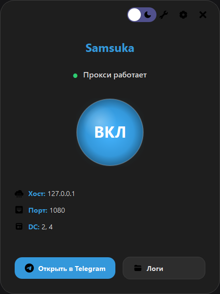
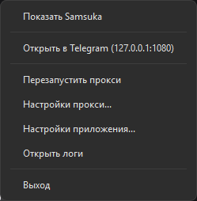
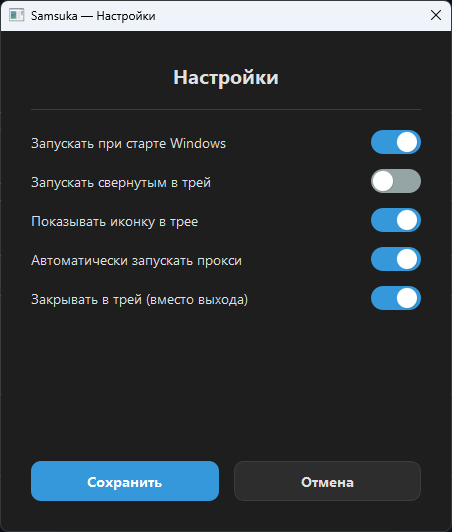

<p align="center">
  
  <h1 align="center">SamsukaProxy</h1>
  <p align="center">
    <i>Локальный SOCKS5-прокси для ускорения Telegram Desktop через WebSocket</i>
  </p>
  <p align="center">
    <a href="https://github.com/Flowseal/tg-ws-proxy/"></a>
    <a href="https://vizi1337.github.io/samsukaproxy-site/"></a>
    <a href="https://github.com/vizi1337"></a>
  </p>
</p>

## 📋 Описание

**SamsukaProxy** — это модифицированная версия [tg-ws-proxy](https://github.com/Flowseal/tg-ws-proxy/) от **Flowseal**, которая создаёт локальный SOCKS5-прокси для перенаправления трафика Telegram Desktop через WebSocket-соединения. Это помогает частично ускорить загрузку файлов, сообщений и медиа, аналогично эффекту от прокидывания hosts для Web Telegram.

### 🎯 Ожидаемый результат
- Ускорение загрузки и скачивания файлов
- Более быстрая загрузка сообщений
- Оптимизация загрузки медиа

---

## 🔧 Как это работает


1. Приложение поднимает локальный SOCKS5-прокси на `127.0.0.1:1080`
2. Перехватывает подключения к IP-адресам Telegram
3. Извлекает DC ID из MTProto obfuscation init-пакета
4. Устанавливает WebSocket (TLS) соединение к соответствующему DC через домены `kws{N}.web.telegram.org`
5. Если WebSocket недоступен (302 redirect) — автоматически переключается на прямое TCP-соединение

---

## ✨ Особенности

### 🚀 Основной функционал
- **Локальный SOCKS5 прокси** — создает прокси на `127.0.0.1:1080` (порт настраивается)
- **WebSocket обертка** — оборачивает MTProto трафик в WebSocket для обхода блокировок
- **Автоматическое определение DC** — определяет дата-центр Telegram и направляет трафик через правильный WebSocket
- **Поддержка всех DC** — работает с DC 1-5 и DC 203
- **Fallback на TCP** — при недоступности WebSocket автоматически переключается на прямое TCP соединение

### 🎨 Интерфейс
| | |
|---|---|
| **Темная тема** | **Светлая тема** |
|  |  |
| **Меню в трее** | **Настройки** |
|  |  |

- **Стильный дизайн** — современный интерфейс с закругленными углами и плавными анимациями
- **Темная/светлая тема** — переключение темы одним кликом
- **Кастомное меню в трее** — удобное управление из системного трея
- **Большая кнопка питания** — визуально понятное включение/выключение прокси
- **Поддержка иконок** — все элементы интерфейса используют векторные иконки

### ⚙️ Настройки
- **Автозапуск с Windows** — программа может запускаться при старте системы
- **Запуск свернутым в трей** — приложение не показывает окно при запуске
- **Настройка прокси** — изменение хоста, порта и DC-маппингов
- **Verbose логирование** — подробные логи для отладки
- **Закрытие в трей** — при нажатии на крестик программа сворачивается в трей

### 📊 Статистика и мониторинг
- **Реальные логи** — все события записываются в лог-файл
- **Статус прокси** — визуальный индикатор работы
- **Информация о соединении** — отображение текущего хоста, порта и активных DC

---
## 🚀 Старт из коробки 

### Вариант 1: Скачать готовый бинарник
1. Перейдите в [раздел Releases](https://github.com/ваш-username/SamsukaProxy/releases)
2. Скачайте SamsukaProxy.exe
3. Запустите файл

### Вариант 2: Сборка из исходников
```
pip install -r requirements.txt
```
### For windows 10/11
```
python samsuka.py
```

## ☁️ Открывайте программу через трей
```
Конфиги и логи лежат в C:\Users\YourUser\AppData\Roaming\Samsuka
```
---
## 🛡️ Реакция антивирусов

> ⚠️ **Важно:** Windows Defender может ошибочно распознать программу как вирус. Это связано с особенностями работы с сетью (перехват трафика) и упаковкой бинарника, а не с реальной угрозой.

Если вы не можете скачать из-за блокировки:
- Временно отключите антивирус на время установки
- Или добавьте программу в исключения

---

# 🔄 Отказ от ответственности
### **Репозиторий оригинальной программы:** https://github.com/Flowseal/tg-ws-proxy/

### Я не выдаю свою модификацию за отдельное приложение.
### Вы можете модифицировать мой код как вам угодно.
### Исходный код предоставляется "как есть" без каких-либо гарантий. Используйте на свой страх и риск.

<p align="center"> <sub>Сделано vizi1337 для сообщества Telegram<br>Особая благодарность <a href="https://github.com/Flowseal">Flowseal</a> за оригинальный tg-ws-proxy</sub> </p> 
